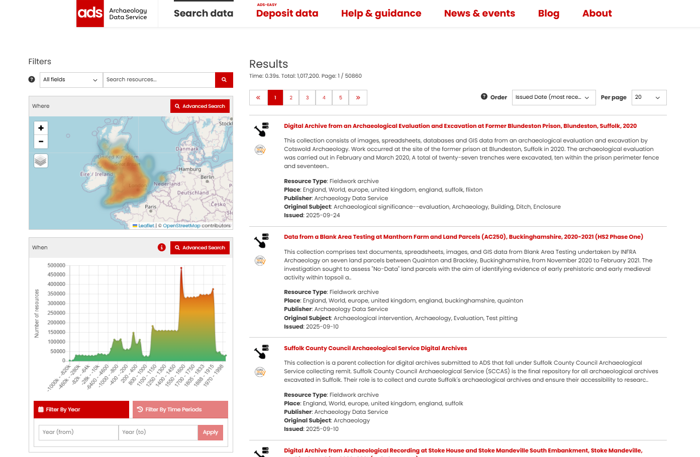
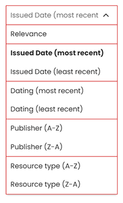
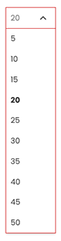

# Searching the Catalogue

Navigating to the Data Catalogue opens the Results page, with filtering options displayed along the left hand side. By default, the catalogue displays all available results, which you can then filter using three key search parameters: [**What**](Section-1_What.md), [**Where**](Section-2_Map_Where.md), and [**When**](Section-3_Time_period_When.md).

{ width="850" }

<i>Search results page</i>

Each record shown in the search results has a **Resource Type** icon next to its title. These types organise different resources into general areas of interest to archaeologists. To see the name of the Resource Type, just hover your mouse over the icon. If a resource contains more than one Resource Type, then the icon will be displayed for first type listed in the metadata, regardless of the which Resource Type you may have selected in the filter. 

Resources that are found in a [**CoreTrustSeal certified repository**](https://www.coretrustseal.org/) will display an additional icon below the Resource Type.

<i>Record of Resource type Site/Monument with the CoreTrustSeal icon (and text displayed with mouseover)</i>

## Options for displaying the results
At the top right hand side of the Results page, there are two options for controlling how results are displayed: **Order** and **Per page**.

| Order |  |
| ------------- | ----------- |
|  | **Relevance** - calculated from several fields (see below).  **Issued date** - date of publication of the resource (default setting).  **Dating** - dating (e.g. Roman) of resource record.  **Publisher** - data provider of the resource metadata.  **Resource type** - broad resource type (as defined in Search Filters).|

| Per page |  |
| ------------- | ----------- |
|  | The number of resources shown on the Results page (default number is 20).   The **Per page** option enables you to choose how many results are displayed per page, from 5 to 50. |

### How ‘Relevance’ is calculated

**Relevance** is a score assigned to resources based on how well they match the current search criteria. This score determines the order in which the resources appear in your results. The algorithm prioritises matches to the Title field, followed by matches in the Description and Subject fields. Following those fields, other fields such as location and time are also used to add to the overall relevance score. 

## Refining the search results
You can refine your search results by using a combination of **What, Where** and **When** parameters, as well as the individual filters. The following sections explain how each of these options can be used to narrow down the search results.