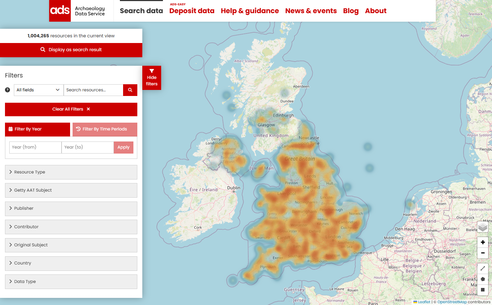

# Where - The Map tool

| Where | Description |
| ----------- | ----------- |
| &nbsp;&nbsp;&nbsp;&nbsp;&nbsp;&nbsp;&nbsp;&nbsp;&nbsp;&nbsp;&nbsp;&nbsp;&nbsp;&nbsp;&nbsp;&nbsp;&nbsp;&nbsp;&nbsp;&nbsp;&nbsp;&nbsp;&nbsp;&nbsp;&nbsp;&nbsp;&nbsp;&nbsp;&nbsp;&nbsp;&nbsp;&nbsp;&nbsp;&nbsp;&nbsp;&nbsp;&nbsp;&nbsp;&nbsp;&nbsp;&nbsp;&nbsp;&nbsp;&nbsp;&nbsp;&nbsp;&nbsp;&nbsp;&nbsp;&nbsp;&nbsp;&nbsp;&nbsp;&nbsp;&nbsp;&nbsp;&nbsp;&nbsp;&nbsp;&nbsp;&nbsp;&nbsp;&nbsp;&nbsp;&nbsp;&nbsp;&nbsp;&nbsp;&nbsp;&nbsp;&nbsp;&nbsp;&nbsp;&nbsp;&nbsp;&nbsp;&nbsp;&nbsp;&nbsp;&nbsp;&nbsp;&nbsp;&nbsp;&nbsp;&nbsp;&nbsp;&nbsp;&nbsp;&nbsp;&nbsp; | The map on the Search results page displays the location of resources returned in the search results (where co-ordinates have been provided in the metadata). These are shown as ‘heat spots’ on the map interface.   It is possible to zoom in and out (to a limited level) and to change the layers as indicated by the icons. See "Map filter options" below for more information.  By default, using the zoom in and out options will not change the defined area or the search results. |
|  | This map search can be used to refine the results. After zooming in, a new option, “Search area”, will appear at the top of the map. Clicking this button  will update the search area to that currently shown by the map and the search results. Once the search area is zoomed in or the number of resources is 500 or less, the heat map is replaced by clusters and pins to show resource locations. Increasing the map area does not change the results again until the “Search area” option is used.   For more complicated search areas and greater geographical resolution, the “Advanced search” option should be used. |

## Advanced search

Clicking on ‘Advanced Search’ will open the Map filter page where the search results can be refined geographically by selecting an area on the map.

<i>Map filter page with full set of filters (left) geographical tools (right)</i>

The map can be used with the other search filters displayed on the left side of the screen. They can be hidden by clicking on the "Hide filter" button to the right of this column. 

The default base map view is a Open Street Map (OSM) showing national borders. Native language place names are used on this map. 

## Map filter options

A series of icons are located in the bottom right hand corner of the map. These tools represent a number of options to filter results using the map tool.

| Icon | Description |
| ----------- | ----------- |
|  | The Layers icon displays a sub-menu with six different options for the display of the base map, including Google Satellite and street map. English is used for all place names. |
|  | The Zoom (in and out) icons for panning in and out of geographic regions. This can also be achieved with a touchpad and mouse where enabled.|
|  | The Drawing tools icons:  The Line tool displays the distance covered between each point drawn. 
The Polygon tool defines a multi-sided area on the map.   The Rectangle tool defines a rectangular area on the map between two opposite corners. 
The results are updated to display only the records located within the defined areas. |

Each of the drawing tools has options to complete, edit or cancel the operation. 

### Display as search result
Once an area of interest has been defined, all the related resources can be displayed on the Results page by clicking on the ‘Display as search result’ button in the top left corner of the screen. The number of resources within the curent view are listed above the button.

<i>Map shown in Google Satellite mode showing both individual and clusters of resources</i>

## Representation of resources on the map
### Pin icons

<i>Pin icons used to represent individual resources on the Map</i>

  
Different icons are used to represent how resources are shown on the map tool.

- A Geo point shows a single resource with exact co-ordinates. If there are more than one Geo point on the Map, then the one for the current resource is denoted by an inner red ring. 
- A Geo shape indicates where the location of a resource is not precise. This may be due to the resource location being given as a geographical area (e.g. a town or region) or, where reports cover a large and/or multiple locations.
- Approx. location icons are shown where the location of the resource is considered to be sensitive, for example, ship wrecks or sites where valuable metal artefacts have been found. Blue ‘pins’ indicate an approximate point and red ‘pins’ an area. The individual record for red ‘pin’ sites will display a defined (often rectangular) area for the resource where the actual location will be a random point within the shown area.

| Icons | Description |
| ----------- | ----------- |
|  | In this example, the red outline defines the area in which a gold finger ring was found and contains two other resources with nearby, imprecise locations. Other resources, both with exact and imprecise locations can also be seen within the larger area. |

### Cluster icons

<i>Cluster icons used to represent groups of resources on the Map</i>

Clusters icons are used to denote locations where multiple resources can be found. The different colours indicate the total number of resources - blue = 1-10, yellow = 11-99 and red 100+ resources.

 

Hovering your mouse over each individual Geo point and Geo shape will display the title of the associated resource. In the example below, the circular pattern of Geo shapes refers to a cluster of resources that have all been allocated the same approximate location. This pattern is displayed when the cluster icon is clicked - each pin icon can be clicked on to go to the related resource record. 

Please note that the Map functions operate in the same way for the Map tool on the main Results page. Some minor differences can be found on the map on the individual Resource, specifically the display of an imprecise or approximate location for a resource. 
