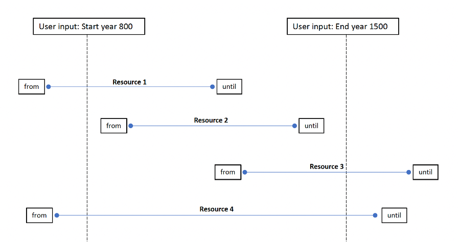
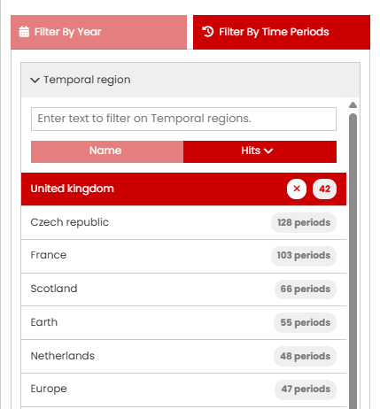
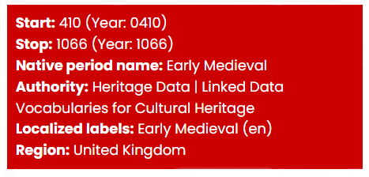

# When - The Time period tool

The When tool consists of three different ways of selecting a time period of interest: a graphic where the mouse can be used to select the date range, a text entry box where the start and end year can be specified and a separate filter that uses named time periods as defined in [PeriodO](https://perio.do/en/).

## The Time line

| The Time line | Description |
| ----------- | ----------- |
| &nbsp;&nbsp;&nbsp;&nbsp;&nbsp;&nbsp;&nbsp;&nbsp;&nbsp;&nbsp;&nbsp;&nbsp;&nbsp;&nbsp;&nbsp;&nbsp;&nbsp;&nbsp;&nbsp;&nbsp;&nbsp;&nbsp;&nbsp;&nbsp;&nbsp;&nbsp;&nbsp;&nbsp;&nbsp;&nbsp;&nbsp;&nbsp;&nbsp;&nbsp;&nbsp;&nbsp;&nbsp;&nbsp;&nbsp;&nbsp;&nbsp;&nbsp;&nbsp;&nbsp;&nbsp;&nbsp;&nbsp;&nbsp;&nbsp;&nbsp;&nbsp;&nbsp;&nbsp;&nbsp;&nbsp;&nbsp;&nbsp;&nbsp;&nbsp;&nbsp;&nbsp;&nbsp;&nbsp;&nbsp;&nbsp;&nbsp;&nbsp;&nbsp;&nbsp;&nbsp;&nbsp;&nbsp;&nbsp;&nbsp;&nbsp;&nbsp;&nbsp;&nbsp;&nbsp;&nbsp; | The Time Line graphic displays the number of resources returned in the search results by date distribution.

The search results can be refined by Clicking on ‘Advanced Search’ to display the Time period filter page (Browse when). 
If no search term is used or the filter is accessed via the ‘Browse when’ option, then the graph shows the date distribution for the entire catalogue. |
|  | In the 'Browse when' page, using the mouse and the Shift key directly on the display, you can define a shorter time period, in this case -200-1400 C.E.

Scrolling with the mouse will cause the time period graphic to expand. 
If the mouse is placed closer to the left side, the x-axis will ‘stretch’ from the left (reducing the end date), placed to the right the start date increases (‘stretch’ from the right).|
|  | Whenever the time line graphic is altered, the range updates to show the selected time span. The distribution of the resources by date is recalculated.

Clicking on ‘Display as search result’ returns to the Results page displaying the refined records. |

## Filter by Year 

An alternative method for selecting a time period is to enter the start and end years in the text box below the graph. 

In both methods, (graph and direct year entry), all records that specify a time period that either falls within and/or overlaps the specified time period will be returned in the results – as shown in the illustration below.

<i>How the time period filter works with the start and end dates specified for each resource</i>

## Filter by Time Periods

The third option enables filtering of the results by named time periods as defined in [PeriodO](https://perio.do/en/). There are two stages for this filter: Temporal region and Cultural period. The Cultural period can be used as a standalone filter or in combination with the filter for Temporal region.

### Temporal region

| Filter by Time periods | Description |
| ----------- | ----------- |
|  | This option is used to select one or more (mostly modern) regions of interest. The majority are at the country level, although there are also some larger (historical) areas such as the Byzantium Empire.

Next to each of the region names is the number of defined periods in PeriodO. |

Clicking on the Temporal region box will display the first 20 regions in order of the highest number of defined periods onwards. Alternatively, the text input box, located above the list, can also be used to find a region. As letters are inpuuted, all matching options are shown. One or more regions can be selected from the list. 

| Temporal region | Description |
| ----------- | ----------- |
|  | Each selected region automatically moves up to the top part of the list. Regions can be removed and added as required. 
Once selection of the regions is completed, click on the Cultural period Option to display the list of periods associated with each region. These are listed in date order, starting with the earliest. 
Note that the time period graph, map or results page do not update as the filter is not complete until one or more Cultural periods have been applied. |

### Cultural period

| Cultural period | Description |
| ----------- | ----------- |
|   |<i>Cultural periods</i> displays all the named periods in date order (from earliest) along with the number of matching resources. For each named period, the matching territory is indicated (with ISO 3 letter country code, if available) along with the start year, the number of resources and a Help icon. 
Once both at least one <i>Temporal region</i> and one<i>Cultural period</i> have been selected, the Results page is updated along with the Time line. |
|  | Hovering the mouse over the Help icon reveals further information about the period. |

The Cultural period box will display up to the first 20 periods. Where more exist, these results can be shown by clicking on the 'Get 20 more results' button at the bottom of the list. Alternatively, the text input box displayed above the list can be used to find periods. All matching options are shown as each letter is input.

The Cultural period filter can also be used independently from the Temporal region filter, especially when a specific period is of interest. For example, entering ‘Roman’ in the Cultural period text box will result in matches from multiple countries. 

