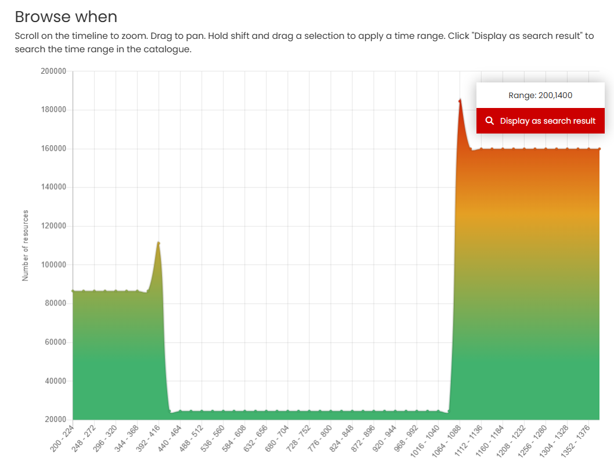
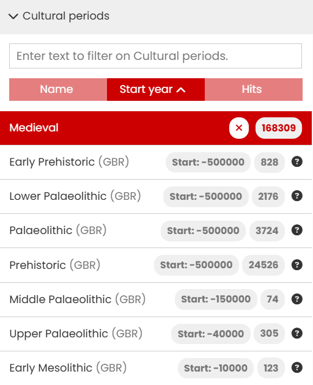

# When - The Time period tool

The When tool consists of three different ways of selecting a time period of interest: a graphic where you can use the mouse to select the date range, a text entry box where you can specify start and end years, and a separate filter that uses named time periods as defined in [PeriodO](https://perio.do/en/).

## The Time line

| The Time line | Description |
| ----------- | ----------- |
| &nbsp;&nbsp;&nbsp;&nbsp;&nbsp;&nbsp;&nbsp;&nbsp;&nbsp;&nbsp;&nbsp;&nbsp;&nbsp;&nbsp;&nbsp;&nbsp;&nbsp;&nbsp;&nbsp;&nbsp;&nbsp;&nbsp;&nbsp;&nbsp;&nbsp;&nbsp;&nbsp;&nbsp;&nbsp;&nbsp;&nbsp;&nbsp;&nbsp;&nbsp;&nbsp;&nbsp;&nbsp;&nbsp;&nbsp;&nbsp;&nbsp;&nbsp;&nbsp;&nbsp;&nbsp;&nbsp;&nbsp;&nbsp;&nbsp;&nbsp;&nbsp;&nbsp;&nbsp;&nbsp;&nbsp;&nbsp;&nbsp;&nbsp;&nbsp;&nbsp;&nbsp;&nbsp;&nbsp;&nbsp;&nbsp;&nbsp;&nbsp;&nbsp;&nbsp;&nbsp;&nbsp;&nbsp;&nbsp;&nbsp;&nbsp;&nbsp;&nbsp;&nbsp;&nbsp;&nbsp; | The Time line graphic displays the number of resources returned in your search results by date distribution.

You can refine the search results by clicking ‘Advanced Search’ to display the Time period filter page (see below). 
If no search term is used or the filter is accessed via the ‘Advanced Search’ option, then the graph shows the date distribution for the entire catalogue. |
|  | On the 'Browse when' page, you can define a shorter time period by using the mouse and the Shift key directly on the display - in this case -200-1400 C.E.

Scrolling with your mouse will cause the time period graphic to expand. 
If you place the mouse closer to the left side, the x-axis will reduce the end date (‘stretch’ from the left), placed to the right the start date increases (‘stretch’ from the right).|
|  | Whenever you alter the time line graphic, the range updates to show your selected time span, and the distribution of resources by date is recalculated.

Clicking ‘Display as search result’ returns to the Results page displaying the refined records. |

## Filter by Year 

An alternative method for selecting a time period is to enter the start and end years in the text box below the graph. 

Using either method (graph or direct year entry), all records that specify a time period falling within or overlapping your selected time period will be returned in the results – as shown in the illustration below.

<i>How the time period filter works with the start and end dates specified for each resource</i>

## Filter by Time Periods

This option enables filtering of the results by named time periods as defined in [PeriodO](https://perio.do/en/). There are two stages for this filter: Temporal region and Cultural period. The Cultural period can be used as a standalone filter or in combination with Temporal region.

### Temporal region

| Filter by Time periods | Description |
| ----------- | ----------- |
|  | This option allows you to select one or more (mostly modern) regions of interest. Most are at the country level, although there are also some larger historical areas such as the Byzantium Empire.

Next to each region name is the number of defined periods available in PeriodO. |

Clicking on the Temporal region box will display the first 20 regions in order of the highest number of defined periods onwards. Alternatively, you can use the text input box, located above the list, to find a region. As you type, all matching options are shown. You can select one or more regions from the list. 

| Temporal region | Description |
| ----------- | ----------- |
|  | Each selected region automatically moves to the top of the list. You can remove and add regions as required. 
Once you have completed your selection of the regions, click on the Cultural period option to display the list of periods associated with each region. These are listed in date order, starting with the earliest. 
Please note that the time period graph, map and results page do not update until the filter is complete - you must select at least one Cultural period. |

### Cultural period

| Cultural period | Description |
| ----------- | ----------- |
|   |**Cultural periods** displays all the named periods in date order (from earliest) along with the number of matching resources. For each named period, the matching territory is indicated (with ISO 3 letter country code, where available) along with the start year, resource count, and a Help icon. 
Once you've selected at least one **Temporal region** and one **Cultural period**, the Results page and Time line is updated. |
|  | Hovering the mouse over the Help icon reveals additional information about the Cultural period. |

The Cultural period box will display up to the first 20 periods. When more exist, you can view additional results by clicking the 'Get 20 more results' button at the bottom of the list. Alternatively, use the text input box above the list to search for specific periods. All matching options are shown as you type.

You can also use the Cultural period filter independently from the Temporal region filter, especially when searching for a specific period. For example, entering ‘Roman’ in the Cultural period text box will show matches from multiple countries. 
