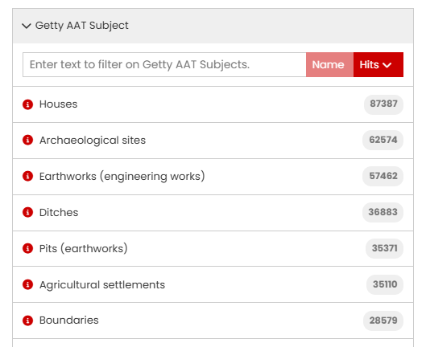
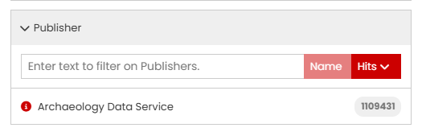
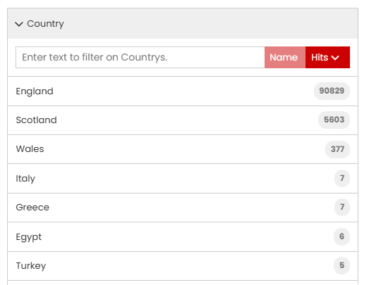

# Search Filters

In addition to the [What](), [Where]() and [When]() tools, there are several filters that each operate on a specific field in the metadata that can be used to refine the search results. There are also the Advanced filters - the And and Or operators - which can be applied to the selected filters.

 

The search results will automatically populate the filters with all the matching terms from the records found. For soe filter (Resource Type, Publisher,  Country), the number of term matches will match the number of records, however, for others (Getty AAT subject, Original subject, Dating), the number of matching terms will exceed the total number of records as these searches will include all other terms found in these fields. 

Using the ‘Clear All Filters’ option (just below the text entry box) will clear all of seacrh filters implemented and revert the search results to the whole Catalogue.

## Filter options on the results page

When one or more of filters are applied to the search, the results are automatically updated and the current selection is shown at the top of the results page. To remove a filter, click the red 'x' on each term and the results list will be updated automatically.

In the example below, the Resource type "Artefact" and the search term "Buttons" has been selected. The "Medieval" period has also been applied from the Time period tool, while the Map tool has also been used to define as area, which is shown as "Bbox: 60,-38,41,47". Bbox stands for Bounding box and the numbers are the latitude and longitude measurements that define the (rectangular) geographical area of interest. If a polygon area is defined, the bounding box will show the minumum and maximum latitude and longitude measurements.

{ width="850" }

# Search Filter Options

Below is a list of the avaiable search filter options including the context for each filter and advice on how best to use those filters. 

## Resource Type

The Resource type is an concept developed by the [ARIADNE RI](https://www.ariadne-research-infrastructure.eu/), which was designed to categorise resources into general areas of interest to archaeologists. The names of these resources types are mostly self-explanatory. 

| Resource Type | Description |
| ----------- | ----------- |
| &nbsp;&nbsp;&nbsp;&nbsp;&nbsp;&nbsp;&nbsp;&nbsp;&nbsp;&nbsp;&nbsp;&nbsp;&nbsp;&nbsp;&nbsp;&nbsp;&nbsp;&nbsp;&nbsp;&nbsp;&nbsp;&nbsp;&nbsp;&nbsp;&nbsp;&nbsp;&nbsp;&nbsp;&nbsp;&nbsp;&nbsp;&nbsp;&nbsp;&nbsp;&nbsp;&nbsp;&nbsp;&nbsp;&nbsp;&nbsp;&nbsp;&nbsp;&nbsp;&nbsp;&nbsp;&nbsp;&nbsp;&nbsp;&nbsp;&nbsp;&nbsp;&nbsp;&nbsp;&nbsp;&nbsp;&nbsp;&nbsp;&nbsp;&nbsp;&nbsp;&nbsp;&nbsp;&nbsp;&nbsp;&nbsp;&nbsp;&nbsp;&nbsp;&nbsp;&nbsp;&nbsp;&nbsp;&nbsp;&nbsp;&nbsp;&nbsp;&nbsp;&nbsp;&nbsp;&nbsp;&nbsp;&nbsp;&nbsp;&nbsp;&nbsp;&nbsp;&nbsp;&nbsp;&nbsp;&nbsp;&nbsp;&nbsp;&nbsp;&nbsp;&nbsp;&nbsp;&nbsp;&nbsp;&nbsp;&nbsp;&nbsp;&nbsp;&nbsp;&nbsp;&nbsp;&nbsp;&nbsp;&nbsp;&nbsp;&nbsp;&nbsp;&nbsp;&nbsp;&nbsp;&nbsp;&nbsp;&nbsp;&nbsp;&nbsp;&nbsp;&nbsp;  | Those Resource types that may need clarification are:   **Fieldwork** – normally a record relating to specific fieldwork e.g. evaluations, interventions, etc.   **Fieldwork report** – these always have a link (URL or DOI) to the actual document.  **Fieldwork archive** – the record refers to a collection of documents, images etc. relating to a site (accessible from the DOI supplied).  **Dating** – datasets using for dating materials e.g. radio carbon and dendrology. |

More than one Resource type can be selected but please note that the default operator on terms within a filter is ‘AND’ so this will only result in records being found where all the selected terms have been used. For example, all “Maritime” resources are also classified as Resource type “Site/monument” so combining both Resource types has the same result as selecting just ”Maritime” (this is logical as currently the maritime records relate to ship wrecks). Conversely, Resource type  “Artefacts” and “Coins” have been applied separately and the only record that is returned matching both Resource types is the Collection record for the Portable Antiquities Scheme. In most cases, this filter is useful for excluding records that do not match the specified Resource type.

## Getty AAT Subjects

The Getty Arts and Architecture Thesaurus (AAT) has been used to classify each resource, mapping the original subject(s) to those found in this extensive ontology. Over one thousand terms have been used and each resource in the catalogue usually has more than one term assigned to it. 

The use of this filter is highly recommended to obtain accurate, meaningful results. 

<i>The Getty Arts & Architecture Thesaurus Subjects filter (seven most commonly used terms for the current Catalogue)</i>

The Getty AAT is structured hierarchically, so when a (single) higher level term is specified in this filter, the search results will also include all the sub-categories. For example, the general term “weapons” will also include resources with terms such as “knives”, “spears” and “daggers” as these are all sub-categories of “weapons”.

When multiple terms are used as a filter, logical ‘AND’ is applied so only resources matching all the terms will be returned in the search results. Hierarchical sub-categories are not used with multiple terms, only the term specified. Hence, if a search was made for “Weapons”  and “Warships”, there are no results but if “Cannons (artillery)” is used instead of "Weapons", then there are results as both the exact terms have been used for the matching resources. 

When a set of search results is displayed, the Getty AAT filter will only show the first 20 terms found within the current set of resources, ordered by number of search results. More terms can be displayed by clicking on the “Get 20 more results..” box at the end of the displayed list. This button extends the list with a scroll bar and can be repeated until all  matching terms are viewed. 

## Publisher

| Publisher | Description |
| ----------- | ----------- |
| &nbsp;&nbsp;&nbsp;&nbsp;&nbsp;&nbsp;&nbsp;&nbsp;&nbsp;&nbsp;&nbsp;&nbsp;&nbsp;&nbsp;&nbsp;&nbsp;&nbsp;&nbsp;&nbsp;&nbsp;&nbsp;&nbsp;&nbsp;&nbsp;&nbsp;&nbsp;&nbsp;&nbsp;&nbsp;&nbsp;&nbsp;&nbsp;&nbsp;&nbsp;&nbsp;&nbsp;&nbsp;&nbsp;&nbsp;&nbsp;&nbsp;&nbsp;&nbsp;&nbsp;&nbsp;&nbsp;&nbsp;&nbsp;&nbsp;&nbsp;&nbsp;&nbsp;&nbsp;&nbsp;&nbsp;&nbsp;&nbsp;&nbsp;&nbsp;&nbsp;&nbsp;&nbsp;&nbsp;&nbsp;&nbsp;&nbsp;&nbsp;&nbsp;&nbsp;&nbsp;&nbsp;&nbsp;&nbsp;&nbsp;&nbsp;&nbsp;&nbsp;&nbsp; | The Publisher is the organisation that has supplied the metadata to the Data Catalogue and is responsible for the maintaining and updating this metadata.   The Publisher may also own the original data or be responsible for its maintenance, as in the case of regional and national repositories. |

The “i” icon next to each name provides a short summary about the Publisher in a new page. This page also shows the geographic distribution of that publishers records on a map and the first 20 record, below a link to the Publisher’s website. The second link will display these results in the standard ‘Results’ page.

{ width="850" }

<i>The Publisher information for Nara, Japan</i>

## Contributor

| Contributor | Description |
| ----------- | ----------- |
| &nbsp;&nbsp;&nbsp;&nbsp;&nbsp;&nbsp;&nbsp;&nbsp;&nbsp;&nbsp;&nbsp;&nbsp;&nbsp;&nbsp;&nbsp;&nbsp;&nbsp;&nbsp;&nbsp;&nbsp;&nbsp;&nbsp;&nbsp;&nbsp;&nbsp;&nbsp;&nbsp;&nbsp;&nbsp;&nbsp;&nbsp;&nbsp;&nbsp;&nbsp;&nbsp;&nbsp;&nbsp;&nbsp;&nbsp;&nbsp;&nbsp;&nbsp;&nbsp;&nbsp;&nbsp;&nbsp;&nbsp;&nbsp;&nbsp;&nbsp;&nbsp;&nbsp;&nbsp;&nbsp;&nbsp;&nbsp;&nbsp;&nbsp;&nbsp;&nbsp;&nbsp;&nbsp;&nbsp;&nbsp;&nbsp;&nbsp;&nbsp;&nbsp;&nbsp;&nbsp;&nbsp;&nbsp;&nbsp;&nbsp;&nbsp;&nbsp;&nbsp;&nbsp;&nbsp;&nbsp;&nbsp; | The Contributor is usually (but not always) the original owner of the data.  The Publisher creates and maps the metadata in the Catalogue on behalf of the Contributor.

## Original Subject

| Original Subject| Description |
| ----------- | ----------- |
| &nbsp;&nbsp;&nbsp;&nbsp;&nbsp;&nbsp;&nbsp;&nbsp;&nbsp;&nbsp;&nbsp;&nbsp;&nbsp;&nbsp;&nbsp;&nbsp;&nbsp;&nbsp;&nbsp;&nbsp;&nbsp;&nbsp;&nbsp;&nbsp;&nbsp;&nbsp;&nbsp;&nbsp;&nbsp;&nbsp;&nbsp;&nbsp;&nbsp;&nbsp;&nbsp;&nbsp;&nbsp;&nbsp;&nbsp;&nbsp;&nbsp;&nbsp;&nbsp;&nbsp;&nbsp;&nbsp;&nbsp;&nbsp;&nbsp;&nbsp;&nbsp;&nbsp;&nbsp;&nbsp;&nbsp;&nbsp;&nbsp;&nbsp;&nbsp;&nbsp;&nbsp;&nbsp;&nbsp;&nbsp;&nbsp;&nbsp;&nbsp;&nbsp;&nbsp;&nbsp;&nbsp;&nbsp;&nbsp;&nbsp;&nbsp;&nbsp;&nbsp;&nbsp;&nbsp;&nbsp;&nbsp;&nbsp;&nbsp;&nbsp;&nbsp;&nbsp;&nbsp;&nbsp;&nbsp;&nbsp;&nbsp;&nbsp;&nbsp;&nbsp;&nbsp;&nbsp;&nbsp;| The original subject is the term from the ontology used by the Contributor and/or Publisher, which has been mapped to the Getty AAT.  The Original subject will, in most cases, be in the native language of the provider. The option to filter using these localised terms facilitates both multi-lingual searches and terminology specific to a single Publisher. |

## Country

| Country | Description |
| ----------- | ----------- |
| &nbsp;&nbsp;&nbsp;&nbsp;&nbsp;&nbsp;&nbsp;&nbsp;&nbsp;&nbsp;&nbsp;&nbsp;&nbsp;&nbsp;&nbsp;&nbsp;&nbsp;&nbsp;&nbsp;&nbsp;&nbsp;&nbsp;&nbsp;&nbsp;&nbsp;&nbsp;&nbsp;&nbsp;&nbsp;&nbsp;&nbsp;&nbsp;&nbsp;&nbsp;&nbsp;&nbsp;&nbsp;&nbsp;&nbsp;&nbsp;&nbsp;&nbsp;&nbsp;&nbsp;&nbsp;&nbsp;&nbsp;&nbsp;&nbsp;&nbsp;&nbsp;&nbsp;&nbsp;&nbsp;&nbsp;&nbsp;&nbsp;&nbsp;&nbsp;&nbsp;&nbsp;&nbsp;&nbsp;&nbsp;&nbsp;&nbsp;&nbsp;&nbsp;&nbsp;&nbsp;&nbsp;&nbsp;&nbsp;&nbsp;&nbsp;&nbsp;&nbsp;&nbsp;  | Country is the modern geographical region(s) that relates to each resource.   The Map tool can be used to define smaller areas or regions that cover more than one country where modern boundaries do not apply. |

## Data Type
| Data Type | Description |
| ----------- | ----------- |
|&nbsp;&nbsp;&nbsp;&nbsp;&nbsp;&nbsp;&nbsp;&nbsp;&nbsp;&nbsp;&nbsp;&nbsp;&nbsp;&nbsp;&nbsp;&nbsp;&nbsp;&nbsp;&nbsp;&nbsp;&nbsp;&nbsp;&nbsp;&nbsp;&nbsp;&nbsp;&nbsp;&nbsp;&nbsp;&nbsp;&nbsp;&nbsp;&nbsp;&nbsp;&nbsp;&nbsp;&nbsp;&nbsp;&nbsp;&nbsp;&nbsp;&nbsp;&nbsp;&nbsp;&nbsp;&nbsp;&nbsp;&nbsp;&nbsp;&nbsp;&nbsp;&nbsp;&nbsp;&nbsp;&nbsp;&nbsp;&nbsp;&nbsp;&nbsp;&nbsp;&nbsp;&nbsp;&nbsp;&nbsp;&nbsp;&nbsp;&nbsp;&nbsp;&nbsp;&nbsp;&nbsp;&nbsp;&nbsp;&nbsp;&nbsp;&nbsp;&nbsp;&nbsp;&nbsp;&nbsp;&nbsp;&nbsp;&nbsp;&nbsp;&nbsp;&nbsp;&nbsp;&nbsp;&nbsp;  | The Data Type refers to the structure of the resource. The majority of resources are digital in format although there are some examples of metadata in the Catalogue that refer to physical publications. |

## Dating

The dating filter works solely on the information in the ‘Dating’ field of the metadata. This is a broad category that includes named periods as well as date numerals, general terms such as ‘16th century’, and localised terms that are specific to regions. The Dating filter is intended to cover all resources, some of which may not have both start and end dates or definition in [PeriodO](https://perio.do/en/). 

| Dating | Description |
| ----------- | ----------- |
| &nbsp;&nbsp;&nbsp;&nbsp;&nbsp;&nbsp;&nbsp;&nbsp;&nbsp;&nbsp;&nbsp;&nbsp;&nbsp;&nbsp;&nbsp;&nbsp;&nbsp;&nbsp;&nbsp;&nbsp;&nbsp;&nbsp;&nbsp;&nbsp;&nbsp;&nbsp;&nbsp;&nbsp;&nbsp;&nbsp;&nbsp;&nbsp;&nbsp;&nbsp;&nbsp;&nbsp;&nbsp;&nbsp;&nbsp;&nbsp;&nbsp;&nbsp;&nbsp;&nbsp;&nbsp;&nbsp;&nbsp;&nbsp;&nbsp;&nbsp;&nbsp;&nbsp;&nbsp;&nbsp;&nbsp;&nbsp;&nbsp;&nbsp;&nbsp;&nbsp;&nbsp;&nbsp;&nbsp;&nbsp;&nbsp;&nbsp;&nbsp;&nbsp;&nbsp;&nbsp;&nbsp;&nbsp;&nbsp;&nbsp;&nbsp;&nbsp;&nbsp;&nbsp;&nbsp;&nbsp;&nbsp;&nbsp;&nbsp;&nbsp;&nbsp;&nbsp;&nbsp;&nbsp;&nbsp;&nbsp;&nbsp;&nbsp;&nbsp;&nbsp;&nbsp; | In this example, all matches to the first four characters “medi” entered in the text box are listed. Several matches to the (intended) term of “medieval” are shown as well as others where different spellings or languages have been used in the original metadata. One term, Holoceno medio (Mid-Holocene) is an unintended match! |
