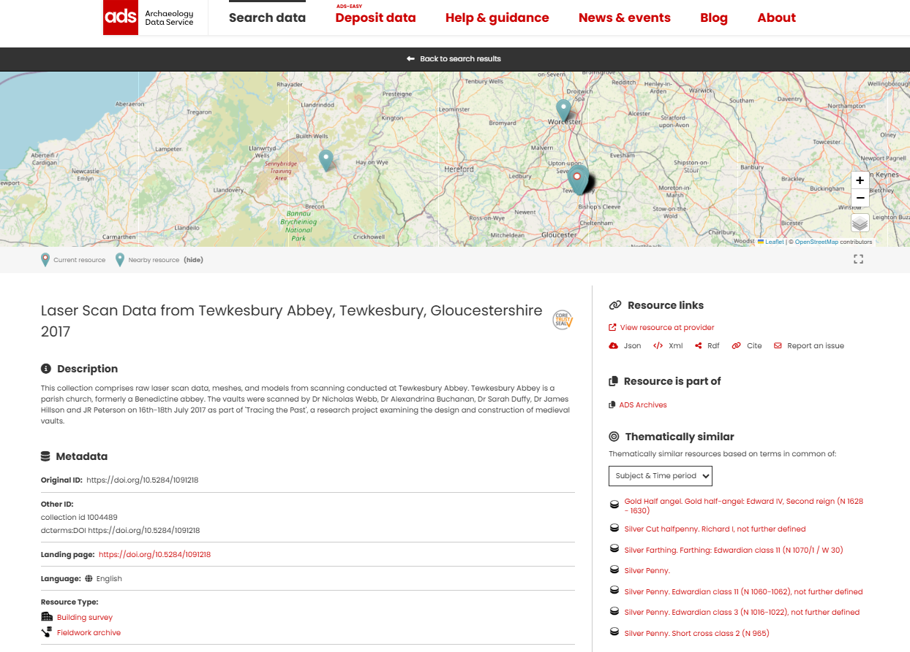
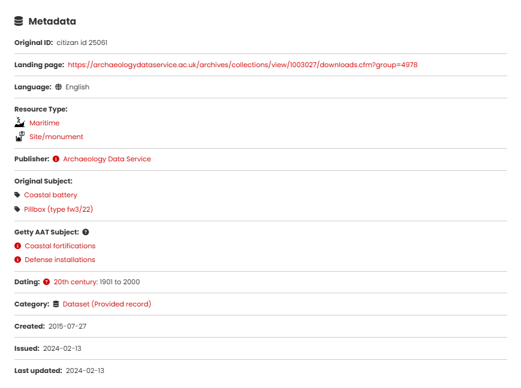
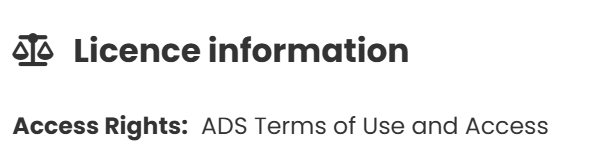
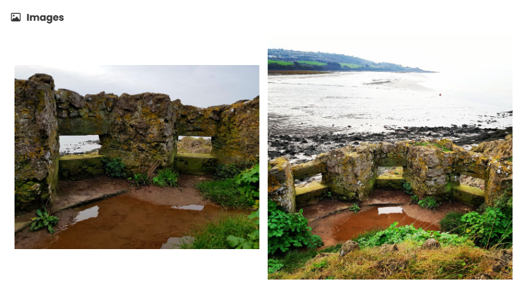
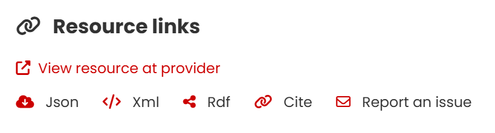
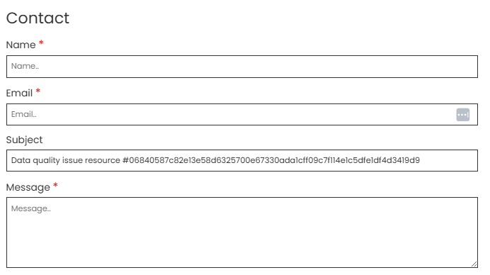
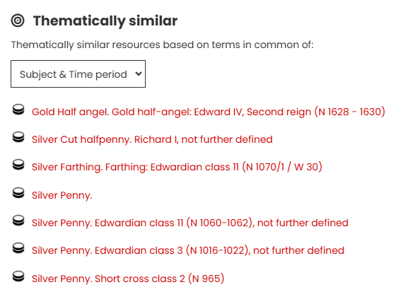

# The Resource page

Clicking on a entry from the Results page opens a new page showing the complete metadata record and all associated information for that item. This page provides a description about the resource, its resource type, location, publisher, subject and date, as well as links to the original resource. At the top of the page, the location of the resource is shown on a map.

!!! Info

    The resource page map works like the main map interface—you can zoom and change the base map. Use the rectangular icon below to resize the map (small, medium, or full screen). Geo points show nearby sites; click them to view those records.

{ width="850" }

<I>Top of the Resource page</I>

##  The metadata

The Resource Page includes all metadata for that resource including, ID, landing page, language, resource type and others.

<I>Resource metadata</I>

### Responsible person and organisations
| Metadata | Description |
| ----------- | ----------- |
|&nbsp;&nbsp;&nbsp;&nbsp;&nbsp;&nbsp;&nbsp;&nbsp;&nbsp;&nbsp;&nbsp;&nbsp;&nbsp;&nbsp;&nbsp;&nbsp;&nbsp;&nbsp;&nbsp;&nbsp;&nbsp;&nbsp;&nbsp;&nbsp;&nbsp;&nbsp;&nbsp;&nbsp;&nbsp;&nbsp;&nbsp;&nbsp;&nbsp;&nbsp;&nbsp;&nbsp;&nbsp;&nbsp;&nbsp;&nbsp;&nbsp;&nbsp;&nbsp;&nbsp;&nbsp;&nbsp;&nbsp;&nbsp;  | **Creator** is the original author of the resource information.    **Contributor** is the organisation or person who has supplied the metadata about the resource.     **Owner** is the organisation or person who owns the licence for the data.     **Responsible** is the organisation or person legally responsible for the maintenance of the resource data.|
 
### Licence information

| Metadata | Description |
| ----------- | ----------- |
| | **Licence** indicates the permitted access and reuse of the metadata.   Additional information about specific Access Policies may be indicated below Access Rights.|

### Images

| Metadata | Description |
| ----------- | ----------- |
|  | Some resources in the Catalogue also have images which are shown at the bottom of the Resource page.    The first image is also shown as a thumbnail with the summary information for that record on the Results page.|

### Resource links

| Option | Description |
| ----------- | ----------- |
|&nbsp;&nbsp;&nbsp;&nbsp;&nbsp;&nbsp;&nbsp;&nbsp;&nbsp;&nbsp;&nbsp;&nbsp;&nbsp;&nbsp;&nbsp;&nbsp;&nbsp;&nbsp;&nbsp;&nbsp;&nbsp;&nbsp;&nbsp;&nbsp;&nbsp;&nbsp;&nbsp;&nbsp;&nbsp;&nbsp;&nbsp;&nbsp;&nbsp;&nbsp;&nbsp;&nbsp;&nbsp;&nbsp;&nbsp;&nbsp;&nbsp;&nbsp;&nbsp;&nbsp;&nbsp;&nbsp;&nbsp;&nbsp;&nbsp;&nbsp;&nbsp;&nbsp;&nbsp;&nbsp;&nbsp;&nbsp;&nbsp;&nbsp;&nbsp;&nbsp;&nbsp;&nbsp;&nbsp;&nbsp;&nbsp;&nbsp;&nbsp;  | **View resource at provider** takes you to the original resource page. Other links offer downloads for other technical formats (listed below).|

**Json** – displays the resource data formatted in a JSON file. This contains all available data (and combinations of data) for that specific resource.

**Xml** – displays the resource data formatted as XML.

**RDF** - generates an RDF file of the resource data.

**Cite** - provides a link for the resource metadata page.

**Report an issue** – generates a contact form (shown below) containing the resource ID (Subject) in which users can report any issues they encounter with the resource.

 

<I>The Contact form</I>

### Resource is a part of

| Metadata | Description |
| ----------- | ----------- |
| &nbsp;&nbsp;&nbsp;&nbsp;&nbsp;&nbsp;&nbsp;&nbsp;&nbsp;&nbsp;&nbsp;&nbsp;&nbsp;&nbsp;&nbsp;&nbsp; | This section displays the Collection or dataset that the resource belongs to. It provides a link to a new page with further information and access to the other resources within the Collection. |

### Thematically similar

| Option | Description |
| ----------- | ----------- |
|&nbsp;&nbsp;&nbsp;&nbsp;&nbsp;&nbsp;&nbsp;&nbsp;&nbsp;&nbsp;&nbsp;&nbsp;&nbsp;&nbsp;&nbsp;&nbsp;&nbsp;&nbsp;&nbsp;&nbsp;&nbsp;&nbsp;&nbsp;&nbsp;&nbsp;&nbsp;&nbsp;&nbsp;&nbsp;&nbsp;&nbsp;&nbsp;&nbsp;&nbsp;&nbsp;&nbsp;&nbsp;&nbsp;&nbsp;&nbsp;&nbsp;&nbsp;&nbsp;&nbsp;&nbsp;&nbsp;&nbsp;&nbsp;&nbsp;&nbsp;&nbsp;&nbsp;&nbsp;&nbsp;&nbsp;&nbsp;&nbsp;&nbsp;&nbsp;&nbsp;&nbsp;&nbsp;&nbsp;&nbsp; |**Thematically similar** lists up to seven similar resources from the entire Catalogue. The default setting is ‘Subject & Time period', which finds resources with similar subjects and time periods, displaying the first seven matches.  In addition to the default term, there are four other criteria you can be use to find similar resources (listed below)|

**Title** – matches resources with all or some words used in the title.

**Location** – finds other resources within 2km of the centroid of the original resource location.

**Subject** – finds resources with the same Original subject classification.

**Time period** – finds resources falling within the same time period (based on start and end dates).
