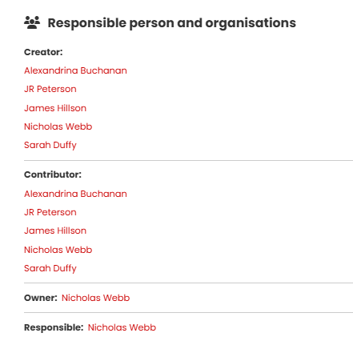
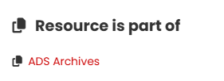

# The Resource page

Clicking on a resource title from a search result opens a new page showing the complete metadata record and all associated information for that item. This page provides a description about the resource, its resource type, location, publisher, subject and date, as well as links to the original resource.

At the top of the page, the location of the resource is shown on a map where you can zoom in and out change the base map. Below these tools there is a rectangular icon with options for changing the dislayed map size to small (default), medium or full screen. 

{ width="850" }

<I>Top part of the Resource page</I>

[The example below](https://portal.ariadne-infrastructure.eu/resource/24d2b18c2f6c0ebe0d3ad5eb5238028efa63d8f03cdd9a7a8c210cd94ae1c1be) is from the DIME database and since it is a find, the location is shown as an approximate area where this particular coin was found. The Geo shape indicates that there is at least one other find nearby and clicking on it will display the relevant record. Multiple finds are displayed in sequence (i.e. click through one at a time) to avoid displaying multiple bounding boxes. The rest of the Resource page is shown below - this collection also has images of the finds so the resource data includes thumbnails pictures.

{ width="850" }

<I>Remaining part of the Resource page</I>

## Display of near-by resources on the map

For each record for an individual resource, the map may display Geo points or shapes for other resources that are located close by and are included in the returned search results. In [the example below](https://portal.ariadne-infrastructure.eu/resource/7c2db68bc992937c2c71040f9da411c0a6f75bb56d139b1570bdce84412502e4), the search term ‘Sword’ was used and this record (published by the National Monuments Service, Republic of Ireland) includes this word in the description of the Chest tomb panel that this record refers to (denoted by Geo shape with the red circle inset). Note that this resource would not be included in the search results if the Getty AAT filter was used with the term "Sword" as this has been classified as a "Tomb". There are several other sites and monuments of interest in this area, each denoted by a separate Geo shape. Clicking on any of the Geo shapes will display the name of the associated resource.

<i>Chest Tomb, Tralee, County Kerry, Ireland and other nearby resources</i>

The display of nearby resources can also result in displaying an approximate location shape for the current resource as well as one or more icons for different nearby resources. In the following example, the resource map shown is for a Gold Quarter stater, resulting from a search for gold coins. There is no Geo shape for the coin, as an approximate location is used as indicated by the red bounding box.  However, seven other nearby resources are shown as separate Geo shapes and each record can be displayed by clicking on the Geo shape associated with it.

<I>Approximate location of Gold Quarter stater shown by red bounding box along with nearby resources</I>

<I>Approximate location of Gold Quarter stater shown by red bounding box with nearby resources now hidden</I>

Nearby resources can be hidden and shown by clicking on the 'hide' button below the map. In the above example, only the approximate location of the resource is now shown after hiding the nearby resources. Pleas note that where the location of a nearby resource is also defined by an approximate location, this is shown as a Geo point as displaying overlapping shapes would obscur the search results. If there is more than one resource with an overlapping bounding box, only the next resource in the sequence is shown. Each overlapping resource may be displayed in turn by clicking through the sequence. 

##  The metadata

The Title of this resource (Mønt) is shown followed by the Description (in Danish) and several other Metadata fields.

<I>Resource metadata for resource Mønt</I>

### Responsible person and organisations, Licence information

| Metadata | Description |
| ----------- | ----------- |
|&nbsp;&nbsp;&nbsp;&nbsp;&nbsp;&nbsp;&nbsp;&nbsp;&nbsp;&nbsp;&nbsp;&nbsp;&nbsp;&nbsp;&nbsp;&nbsp;&nbsp;&nbsp;&nbsp;&nbsp;&nbsp;&nbsp;&nbsp;&nbsp;&nbsp;&nbsp;&nbsp;&nbsp;&nbsp;&nbsp;&nbsp;&nbsp;&nbsp;&nbsp;&nbsp;&nbsp;&nbsp;&nbsp;&nbsp;&nbsp;&nbsp;&nbsp;&nbsp;&nbsp;&nbsp;&nbsp;&nbsp;&nbsp;  | The **Creator** is the original author of the resource information.   The **Contributor** is the organisation or person who has supplied the metadata about the resource.    The **Owner** is the organisation or person who owns the licence for the data.    The **Responsible** is the organisation or person legally responsible for the maintenance of the resource data.    The **Licence** indicates the permitted access and reuse of the metadata, in this case Creative Commons.|
 
### Images

| Metadata | Description |
| ----------- | ----------- |
|  | Some of the resources in the Catalogue also have images which are shown at the bottom of the Resource page.    The first image is also shown as a thumbnail with the summary information for that record on the Results page.|

### Resource links

| Option | Description |
| ----------- | ----------- |
|&nbsp;&nbsp;&nbsp;&nbsp;&nbsp;&nbsp;&nbsp;&nbsp;&nbsp;&nbsp;&nbsp;&nbsp;&nbsp;&nbsp;&nbsp;&nbsp;&nbsp;&nbsp;&nbsp;&nbsp;&nbsp;&nbsp;&nbsp;&nbsp;&nbsp;&nbsp;&nbsp;&nbsp;&nbsp;&nbsp;&nbsp;&nbsp;&nbsp;&nbsp;&nbsp;&nbsp;&nbsp;&nbsp;&nbsp;&nbsp;&nbsp;&nbsp;&nbsp;&nbsp;&nbsp;&nbsp;&nbsp;&nbsp;&nbsp;&nbsp;&nbsp;&nbsp;&nbsp;&nbsp;&nbsp;&nbsp;&nbsp;&nbsp;&nbsp;&nbsp;&nbsp;&nbsp;&nbsp;&nbsp;&nbsp;&nbsp;&nbsp;  | **View resource at provider** is the Landing page URL for that resource. The other Resource links are for technical applications listed below.|

**Json** – displays the resource data formatted in a JSON file. This contains all available data (and combinations of data) for that specific resource.

**Xml** – displays the resource data formatted as XML.

**RDF** - generates an RDF file of the resource data.

**Cite** - provides a link for the resource metadata page.

**Report an issue** – generates a contact form (shown below) containing the resource ID (Subject) in which users can report any issues they encounter with the resource.

 |

<I>The Contact form</I>

### Resource is a part of

| Metadata | Description |
| ----------- | ----------- |
| &nbsp;&nbsp;&nbsp;&nbsp;&nbsp;&nbsp;&nbsp;&nbsp;&nbsp;&nbsp;&nbsp;&nbsp;&nbsp;&nbsp;&nbsp;&nbsp; | This section displays the Collection or dataset that the resource belongs to. It provides a link to a new page with further information and access to the other resources within the Collection. |

### Thematically similar

| Option | Description |
| ----------- | ----------- |
|&nbsp;&nbsp;&nbsp;&nbsp;&nbsp;&nbsp;&nbsp;&nbsp;&nbsp;&nbsp;&nbsp;&nbsp;&nbsp;&nbsp;&nbsp;&nbsp;&nbsp;&nbsp;&nbsp;&nbsp;&nbsp;&nbsp;&nbsp;&nbsp;&nbsp;&nbsp;&nbsp;&nbsp;&nbsp;&nbsp;&nbsp;&nbsp;&nbsp;&nbsp;&nbsp;&nbsp;&nbsp;&nbsp;&nbsp;&nbsp;&nbsp;&nbsp;&nbsp;&nbsp;&nbsp;&nbsp;&nbsp;&nbsp;&nbsp;&nbsp;&nbsp;&nbsp;&nbsp;&nbsp;&nbsp;&nbsp;&nbsp;&nbsp;&nbsp;&nbsp;&nbsp;&nbsp;&nbsp;&nbsp; |Thematically similar lists up to seven similar resources from the entire Catalogue. The default setting is ‘Subject & Time period'. Records with similar (Original) subjects and similar time periods will be searched for and the first seven are listed.|

In addition to the default term of “Subject & Time period”, there are four other criteria you can be use to find similar resources:

- Title – matches resources with all or some words used in the title.
- Location – finds other resources within 2km of the centroid of the original resource location.
- Subject – finds resources with the same Original subject classification.
- Time period – finds resources falling within the same time period (based on start and end dates).
