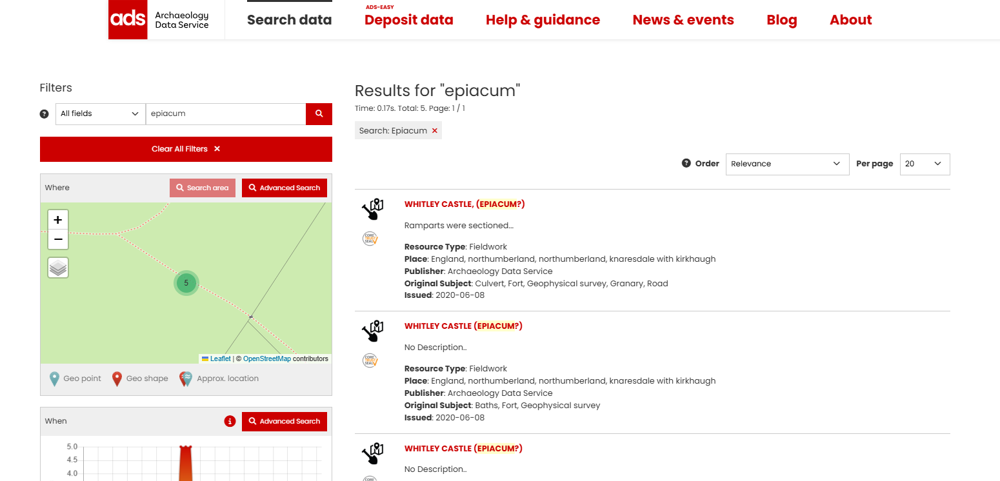
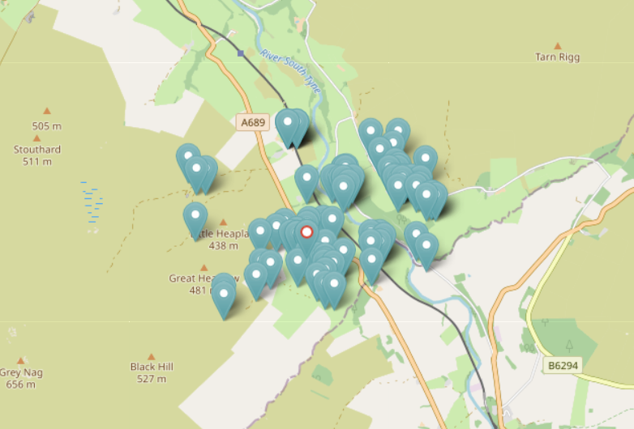
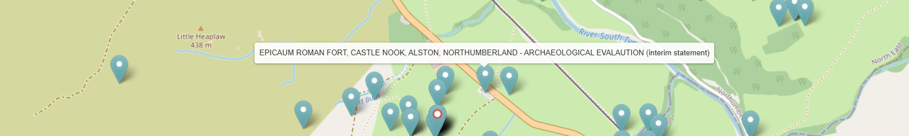
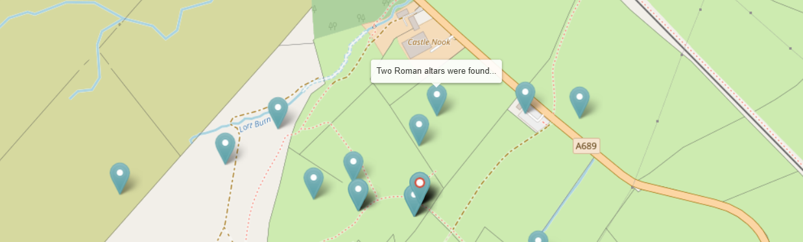

# Tips and Guidance for Searching the Catalogue

## Quick Search Strategies

- **Begin broad, then narrow** - Use general terms first, then apply filters to refine
- **Try multiple name variations** - Sites often have historical and modern names so multiple search variations may be required
- **Combine search methods** - Use text search, filters and the map tools together for a more useful and powerful search result
- **Use the map for location research** - The map search is more effective than country filters for archaeological contexts
- **Check nearby resources** - Related materials often cluster around the same locations

---

## Common Search Challenges

### Text Search Limitations

Text searches return the most results but may include irrelevant matches where your search term appears in a description of a resource rather than as part of the main subject.

!!! info "**Best practice**"

    Always combine text searches with filters like Resource Type and Getty AAT Subjects for more targeted results.

### Location Search Limitation

Although it is possible to search the Catalogue using the (modern-day) Country filter, modern country boundaries often don't match archaeological contexts for various reasons. 

This is true for marine archaeology, where political boundaries don't apply to underwater sites, and for historical periods where ancient territories crossed modern borders. Archaeological evidence also does not respect modern boundaries, meaning that cross-border sites can be artificially divided by contemporary political divisions that have no relevance to the original historical context.

!!! tip "**Better Location Search Methods**"

    Use the Map tool to draw polygons and define custom areas for your searches.

#### Notes

- Not all the resources have geographical co-ordinates supplied in their metadata and therefore will not be searchable via the map interface
- Sensitive locations are show as approximate bounding boxes with random pins
- Multiple resources at sensitive sites appear one at a time as nearby resources on the map interface

---

## Working with Time Periods

Two approaches have been used to denote time periods – absolute start and end dates and period names. There are pros and cons with using both methods:

**Absolute Dates (Start/End Years)**

- ✅ Provides precise chronological boundaries
- ⚠️ If absolute dates are used across more than one country, there may be irrelevant results

**Named Periods (Bronze Age, Medieval, etc.)**

- ✅ Archaeologically meaningful time preiods
- ⚠️ Same period names cover different dates in different countries

---

## Search Example - Epiacum (Whitley Castle) Roman Fort

This example shows how to overcome common challenges like alternative names, misspellings, and different location references.

Epiacum is a Roman Fort located near the town of Alston, Cumbria on the border with Northumbria. It is unusual, being lozenge shaped and with impressive earthworks of banks and ditches and is relatively unexcavated. The fort is also known as Whitley Castle, this name being derived from the nearby Manor of Whitlaw. 

### Step 1: Start with the Primary Name

**Search**: "Epiacum"

**Results**: This search found five records from Historic England covering different periods of investigation: 1957 fieldwork on the fort's ramparts, two early excavations from 1810 and 1828, and a research record titled "Whitley Castle Roman Fort". Importantly, three of these records show both names as "Whitley Castle (Epiacum?)", demonstrating how the same site can be referenced differently across different records.

<I>Search results for "Whitley Castle"</I>

### Step 2: Try Alternative Names

**Search**: "Whitley Castle"

**Results**: 22 resources (including the previous 5)

**Additional findings**: Searching for "Whitley Castle" revealed significantly more resources, adding several Historic England records from recent decades. The expanded results also include a 2007-08 survey, a 2009 geomagnetic survey by Durham University, an English Heritage archaeological investigation, and a 2010 paleoenvironmental study. This demonstrates how using alternative site names can uncover additional research that might otherwise be missed.

### Step 3: Explore the Map
**Search**: Use the map interface and hover over nearby pins

**Additional findings**:

Each of the result are displayed on the map with a number of nearby resources.

<I>Search results for "Whitley Castle"</I>

The Archaeological Evaluation resource, shown below, could have been missed as the name in the title is misspelt. Moreover, the location referred to is the name of the farm on whose land the Roman fort is located.

<I>Highlighting a nearby resource using mouseover</I>

Included in the 22 results for “Whitley Castle” is the resource "Altar, Knaresdale with Kirkhaugh” which refers to two stone altars found around 100m north east of the fort. 

Next to this resource is a second one entitled “Two roman altars were found…”, which was not included in the original search results. This was because the Parish name of “Knaresdale with Kirkhaugh” was used as the location and not “Whitley Castle” nor “Epiacum”. This record also mentions a (lost) third altar and that some coins were also found, which is additional information.

<I>Highlighting a nearby resource using mouseover</I>

#### Key Lessons
- **Try multiple search terms** for the same site
- **Use the map** to find related resources that might use different location names
- **Geographic proximity** reveals connections not apparent in text searches
- **Misspellings and variant names** are common - the map helps overcome this

---

## Advanced Tips

### Understanding Metadata Variations

The metadata in the data catalogue has originated from different sources with varying levels of information and data models. In the first instance, these have been mapped to the AO-CAT which caters for most archaeological domains. However, there are some specialist domains which require additional concepts and terminology to be successfully mapped, otherwise a lot of relevant information would be lost. 

Two approaches have been used to handle specialist domains:

**Application Profiles**

The first solution used is the the Application Profile - an extension of the (CIDOC CRM based) AO-CAT data model. These profiles enable additional data fields to be mapped and added to the Catalogue. Examples of specialist Application Profiles developed during the ARIADNEplus project include the domains of “heritage science” (including aDNA and radiocarbon dating), “inscriptions, marks and graffiti” and “burials and mortuary data”.  

**Additional Ontologies**

An alternative approach, which is more appropriate when a domain can basically map to the AO-CAT but also has its own distinct terminology is to adopt an additional Ontology to extend the vocabulary used for metadata descriptions. 
In many cases, it is possible to map the subject matter to the Getty AAT but as this was developed as a more general thesaurus, it doesn’t always contain the level of detail used in archaeology. To mitigate this, the original subject is also included in the search on all fields in the Catalogue. 

!!! tip "**Getty AAT Hierarchical Searching**"

    When using Getty AAT filters, results will include your specified terms and all related sub-terms. As such, its better to start with general Getty AAT terms and narrow down rather than beginning with very specific terms.
---