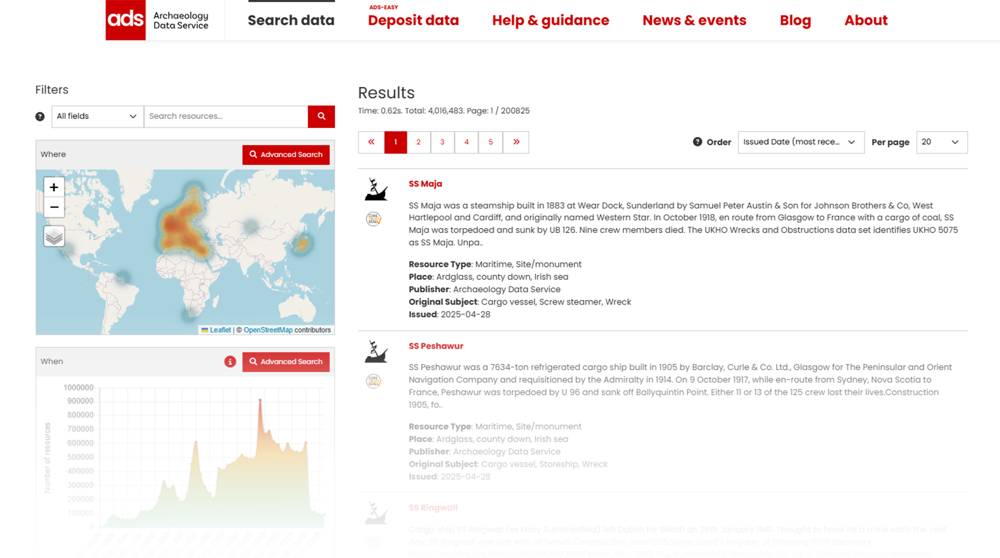

# Getting Started

The Archaeology Data Service [**Data Catalogue**](LINK) is a comprehensive platform for discovering and accessing archaeological data and resources from across the UK. 

With access to over 1 million archaeological resources, the catalogue solves the challenge of discovering relevant materials by bringing together collections deposited with the ADS into one searchable platform. Explore the UK's archaeological heritage through an intuitive interface that lets you search by location, time period, and subject matter.

The Catalogue allows you to search using multiple parameters:

- :classical_building: What (keywords and data types)
- :earth_americas: Where (geographic location)
- :clock1: When (time periods). 

Search results can also be displayed in multiple ways: as individual listings, aggregated on an interactive map, or plotted on a timeline view.

Built on the same robust infrastructure developed by the [ARIADNE Research Infrastructure](https://www.ariadne-research-infrastructure.eu/) for the [ARIADNE Portal](https://portal.ariadne-infrastructure.eu/), our catalogue is specifically designed to serve the needs of the ADS community, while presenting our distinctive collection of archaeological datasets and digital resources.

For further information about the Archaeology Data Service, please visit the [**ADS Website**](https://archaeologydataservice.ac.uk/).

## How to Use This Guide

This user guide will help you navigate the features of the catalogue, from basic searching and browsing to advanced data discovery.

Navigate through the guide using the **menu on the left-hand side of the page**. The guide has been organised to build from basic concepts to more advanced features.

**Navigation features:**

* Click section headings to expand subsections
* Use the search bar at the top of the page to find specific topics
* Your current page is highlighted in the menu
* On mobile devices, tap the menu icon (☰) in the top left hand corner to access the navigation pane

!!! note "**Pro tip**"

    Use the search function at the top of the page to quickly jump to any topic across the entire guide.

Ready to start exploring? Begin with [Searching the Catalogue](Section-0_Searching_Catalogue.md) to learn the basics or jump straight to the [Catalogue](LINK) to start discovering archaeological resources.